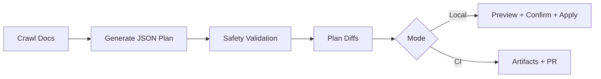

# docs-driven-api-updater

Universal, TypeScript-first, ESM-only SDK maintenance tool that crawls third-party docs and proposes safe updates for integration wrappers, endpoint lists, and README method tables.

## Install

```bash
npm install docs-driven-api-updater
```

## Quick Start

```bash
npx docs-driven-api-updater init
cp .env.example .env
npx docs-driven-api-updater update --dry-run
```

## Add Any API Integration

1. Create a directory for the integration (example: `src/integrations/shopify`).
2. Add a methods registry JSON (example: `src/integrations/shopify/supported-methods.json`).
3. Add/update your wrapper `.ts` files in that integration directory.
4. Register the integration in `updater.config.json`:

```json
{
  "integrations": [
    {
      "name": "shopify",
      "docUrls": ["https://shopify.dev/docs/api/admin-rest"],
      "methodsFile": "src/integrations/shopify/supported-methods.json",
      "targetDir": "src/integrations/shopify"
    }
  ]
}
```

5. Run updater preview:

```bash
npx docs-driven-api-updater update --dry-run
```

## Updater Pipeline

The updater is **docs-driven**, not runtime mutation. It creates reviewable file updates for local/CI usage.

1. **Doc crawl**: `crawlAllDocs()` fetches configured docs and extracts normalized text + table rows.
2. **Plan generation**: `askOllamaForPatchPlan()` sends docs + current `supported-methods.json` to OpenRouter or Ollama and expects strict JSON:
   - `summary`
   - `updatedMethods`
   - `changes`
   - `files` (full file outputs)
   - `readmeTable`
3. **Diff planning**: `planDiffs()` produces git-style previews for allowed targets:
   - `src/integrations/*/*.ts`
   - `README.md`
   - each integration `supported-methods.json`
4. **Safety gate**: `validateUpdaterPlanSafety()` rejects suspicious plans (placeholder rewrites, destructive class replacements, abnormal file shrink).
5. **Preview + apply**: `runUpdateCommand()` prints diffs, asks for confirmation (unless `--yes`/`--ci`), applies changes, syncs methods, and rebuilds.
6. **CI/PR flow**: writes artifacts and opens PR rather than silently changing main.



## CLI Commands

### `init`

Creates:
- `updater.config.json`
- `.env.example`
- starter `src/integrations/stripe/supported-methods.json`

### `update`

```bash
npx docs-driven-api-updater update [options]
```

Flags:
- `--dry-run`: compute plan + preview diffs without writing files
- `--yes`: auto-confirm apply
- `--ci`: CI mode (non-interactive)
- `--open-pr`: produce PR metadata artifacts
- `--fallback-models "modelA,modelB"`: CLI model failover override
- `--max-model-attempts 3`: cap fallback attempts

## Safety & Reliability

- Provider abstraction: OpenRouter and local Ollama.
- Fallback chain: tries multiple models with short backoff.
- Retry-aware statuses: `402`, `404`, `408`, `429`.
- Prompt truncation knobs: limit docs/method payload sizes.
- Sanitized errors: avoids dumping secrets and huge request bodies.
- Safety gate: rejects suspicious destructive model output patterns.

## CI / PR Automation

Workflow: `.github/workflows/auto-update-pr.yml`

- Supports schedule and manual dispatch.
- Runs updater in CI mode.
- Writes:
  - `.artifacts/update-plan.json`
  - `.artifacts/update-diff-summary.json`
  - `.artifacts/pr-title.txt`
  - `.artifacts/pr-body.md`
- Opens PR (not direct mutation of main branch).
- Supports `dry_run` dispatch input.

## Error Handling Guide

- **Missing config**: run `npx docs-driven-api-updater init`.
- **Provider auth errors**: verify `OPENROUTER_API_KEY` or `OLLAMA_HOST`.
- **Schema validation failure**: model output was not strict JSON; use fallback models or lower prompt size.
- **Safety gate failure**: inspect `.artifacts/update-plan.json` and rerun with tighter prompts.
- **No diffs generated**: docs may not contain relevant changes; verify `docUrls` and integration file paths.

## Rate-Limit & Cost Control

Use `.env` knobs:

- `UPDATER_DOC_MAX_CHARS`: lower docs payload size.
- `UPDATER_PROMPT_DOC_MAX_CHARS`: hard cap LLM docs context.
- `UPDATER_PROMPT_METHODS_MAX_CHARS`: cap methods context.
- `MAX_MODEL_ATTEMPTS`: reduce fallback attempts.
- `UPDATER_LLM_TIMEOUT_MS`: prevent runaway requests.

Strategy:

1. Start with `--dry-run`.
2. Keep integrations small and focused.
3. Add only high-signal docs URLs.
4. Run weekly in CI.

## Updated Methods Snapshot

<!-- AUTO-GENERATED-METHODS-TABLE:START -->
| Integration | Method | Status | Notes |
|---|---|---|---|
| stripe | customers.create | stable | baseline template method |
| stripe | charges.create | stable | baseline template method |
<!-- AUTO-GENERATED-METHODS-TABLE:END -->
